# JavaScript Variable Scope
### Область действия относится к доступности переменных и функций в определенных частях кода.
### В JavaScript переменная имеет два типа области видимости:

### 1. Глобальный область
### 2. Локальная область
#
## Глобальный область
### Переменная, объявленная в начале программы или вне функции, считается глобальной переменной области видимости.
### Давайте посмотрим на пример глобальной переменной области видимости.
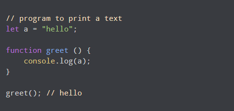
### В приведенной выше программе переменнаяаобъявляется в начале программы и является глобальной переменной. Это означает, что переменная aможет использоваться в любом месте программы.
### Значение глобальной переменной можно изменить внутри функции. Например,
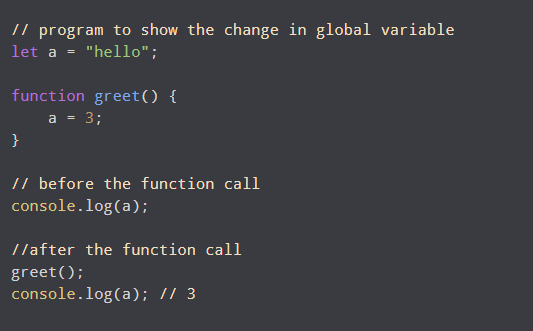
### В приведенной выше программе переменнаяаявляется глобальной переменной. Значениеаявляетсяпривет. Тогда переменнаяаосуществляется внутри функции, и значение изменяется на 3.

#
## Локальная область

### Переменная также может иметь локальную область видимости, т. е. доступ к ней возможен только внутри функции.

### Пример 1: переменная локальной области видимости
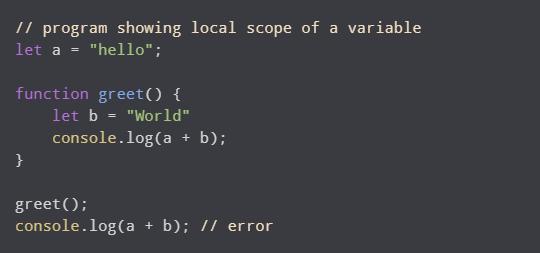
### Выход

#
## Пример 2: переменная с блочной областью действия
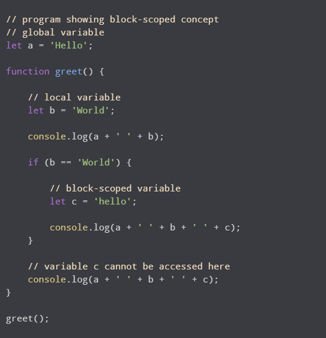
### Выход
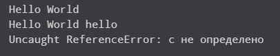

#
# JavaScript Hoisting
### Hoisting в JavaScript — это поведение, при котором функция или переменная могут использоваться до объявления. Например,
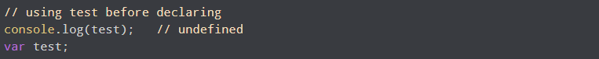

### Вышеупомянутая программа работает, и вывод будет  undefined. Вышеупомянутая программа ведет себя как 
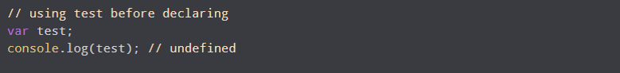
### Поскольку переменнаятесттолько объявлено и не имеет значения, undefined ему присваивается значение. 
## Function Hoisting
### Функцию можно вызвать до ее объявления. Например
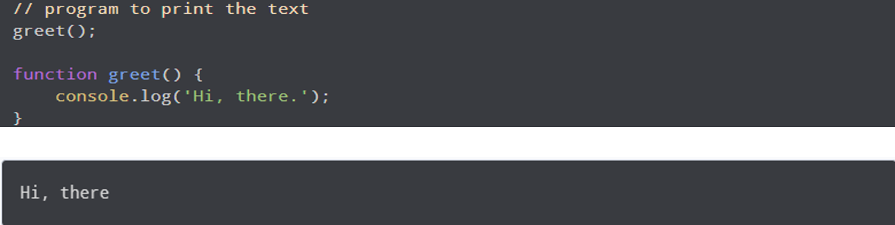
### В приведенной выше программе функция greetвызывается перед ее объявлением, и программа показывает результат. Это связано с подъемом. 
# 
# JavaScript Recursion
### Рекурсия — это процесс вызова самого себя. Функция, которая вызывает сама себя, называется рекурсивной функцией.
### Синтаксис рекурсивной функции:
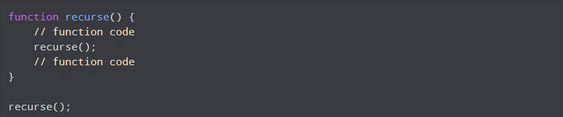
### Здесь recurse() функция является рекурсивной функцией. Он вызывает себя внутри функции. 
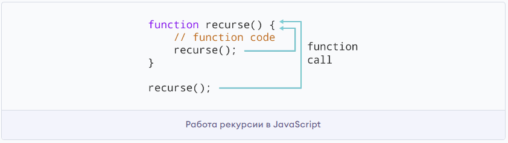

### Рекурсивная функция должна иметь условие для прекращения вызова самой себя. В противном случае функция вызывается бесконечно.
# 
# Closure in JavaScript
### А замыкание — это комбинация функции, связанной вместе (приложенной) со ссылками на окружающее его состояние (лексическое окружение). Другими словами, замыкание дает вам доступ к области действия внешней функции из внутренней функции 
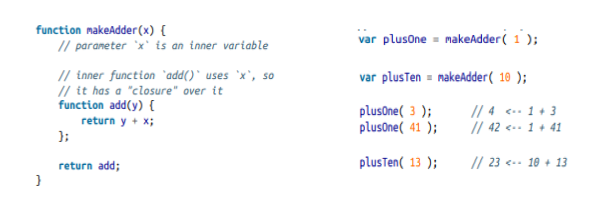
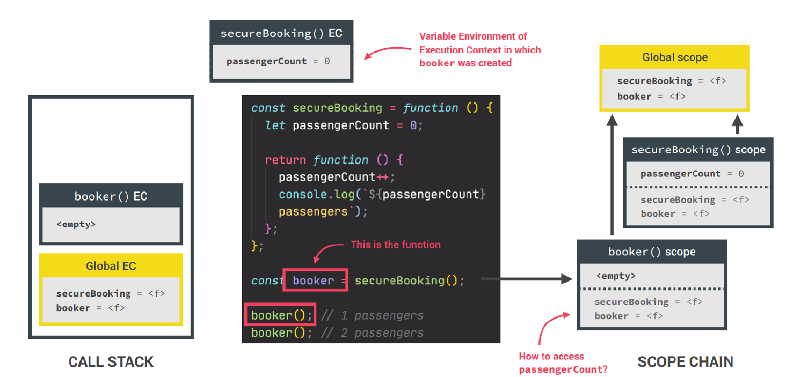